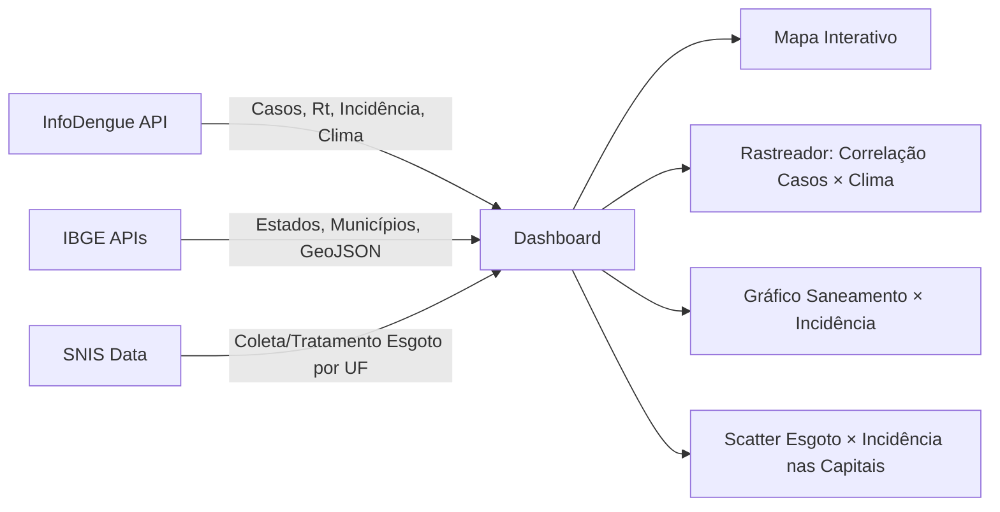

# VigiSaúde Brasil — Dashboard de Vigilância Epidemiológica

---

## Sobre o Projeto

O **VigiSaúde Brasil** é um dashboard de vigilância epidemiológica que monitora **Dengue**, **Chikungunya** e **Zika** em tempo real, correlacionando dados de doenças com indicadores de **saneamento básico** por estado.

O objetivo é visualizar a relação entre a cobertura de coleta e tratamento de esgoto e a incidência de arboviroses no Brasil.

---

## Funcionalidades

- **Mapa Interativo (Múltiplas Camadas)** — Alterne entre mapas de calor de alertas de doenças (dengue, chikungunya, zika) e camadas de infraestrutura de esgoto (coleta e tratamento por estado).
- **Rastreador de Doenças** — Gráfico de correlação unificado que cruza casos mensais, umidade média e temperatura média por localidade selecionada.
- **Saneamento × Incidência** — Gráfico dedicado que compara a cobertura de esgoto (SNIS) com a incidência média da doença selecionada por cidade.
- **Comparação de Localidades** — Adicione e compare múltiplas cidades e estados simultaneamente nos gráficos.
- **3 Patógenos** — Dengue, Chikungunya e Zika via InfoDengue (Fiocruz).
- **Painel Info** — Scatter plot de correlação entre cobertura de esgoto e incidência nas capitais brasileiras.
- **Busca de Municípios** — Pesquisa entre 5.570+ municípios do IBGE.
- **Tema claro** — Interface limpa com paleta de cores pastel e fonte Ubuntu Mono.

---

## APIs Públicas Utilizadas

| API | Descrição | Endpoint |
|-----|-----------|----------|
| **[InfoDengue](https://info.dengue.mat.br/)** | Alertas de Dengue, Chikungunya e Zika por semana epidemiológica | `info.dengue.mat.br/api/alertcity` |
| **[IBGE Localidades](https://servicodados.ibge.gov.br/api/docs/localidades)** | Estados e municípios do Brasil | `servicodados.ibge.gov.br/api/v1/localidades` |
| **[IBGE Malhas](https://servicodados.ibge.gov.br/api/docs/malhas)** | GeoJSON do mapa do Brasil por UF | `servicodados.ibge.gov.br/api/v3/malhas` |
| **[SNIS/SINISA](https://www.gov.br/cidades/pt-br/assuntos/saneamento/snis)** | Cobertura de esgoto por estado | Dados compilados (referência 2022/2023) |

> Todas as APIs são **públicas e gratuitas**, sem necessidade de autenticação.

---

## Arquitetura

```
vsb-dashboard/
├── index.html              # Estrutura HTML (3 views: Mapa, Rastreador, Info)
├── vite.config.js          # Configuração do Vite + proxy de desenvolvimento
├── render.yaml             # Configuração de deploy no Render (static site)
├── package.json
├── .gitignore
└── src/
    ├── main.js             # Entry point — orquestra componentes e estado global
    ├── services/
    │   └── api.js          # Serviço de dados (InfoDengue, IBGE, SNIS, cores)
    ├── components/
    │   ├── map.js          # Mapa Leaflet: GeoJSON, heatmap SVG, camada de esgoto
    │   ├── charts.js       # Gráficos Chart.js (correlação, saneamento×incidência, scatter)
    │   ├── cards.js        # Cards de alerta por doença na sidebar
    │   └── filters.js      # Filtros, seletores de doença/ano, busca de municípios
    └── styles/
        └── index.css       # Design system completo (tema claro, paleta pastel, Ubuntu Mono)
```

### Fluxo de Dados


```mermaid
graph LR
    A[InfoDengue API] -->|Casos, Rt, Incidência, Clima| D[Dashboard]
    B[IBGE APIs] -->|Estados, Municípios, GeoJSON| D
    C[SNIS Data] -->|Coleta/Tratamento Esgoto por UF| D
    D --> E[Mapa Interativo]
    D --> F[Rastreador: Correlação Casos × Clima]
    D --> G[Gráfico Saneamento × Incidência]
    D --> H[Scatter Esgoto × Incidência nas Capitais]
```

---

## Como Executar Localmente

### Pré-requisitos

- [Node.js](https://nodejs.org/) v18+
- npm

### Instalação

```bash
# Clone o repositório
git clone https://github.com/madsondeluna/vsb-dashboard.git
cd vsb-dashboard

# Instale as dependências
npm install

# Inicie o servidor de desenvolvimento
npm run dev
```

O dashboard estará disponível em **http://localhost:3000**.

Em desenvolvimento, as chamadas à API do InfoDengue são roteadas via proxy Vite (`/api/infodengue → info.dengue.mat.br/api`) para evitar problemas de CORS. Em produção, a API é chamada diretamente.

---

## Deploy

O projeto está disponível em produção em:

**[https://vsb-dashboard.onrender.com](https://vsb-dashboard.onrender.com)**

Hospedado como **Static Site** no [Render](https://render.com) via `render.yaml`. Qualquer push para `main` dispara um novo deploy automaticamente.

**Build command:** `npm install && npm run build`
**Publish directory:** `dist`

Para gerar o build manualmente:

```bash
npm run build
# pasta dist/ contém o site estático pronto
```

---

## Dados de Saneamento

Os dados de saneamento são do **SNIS (Sistema Nacional de Informações sobre Saneamento)**, referência 2022/2023. Incluem:

- **% Coleta de Esgoto** — Parcela da população com coleta de esgoto sanitário por estado
- **% Tratamento de Esgoto** — Parcela do esgoto coletado que recebe tratamento por estado

A correlação com dados epidemiológicos permite analisar como a infraestrutura de saneamento influencia a incidência de arboviroses no Brasil.

---

## Tecnologias

- **[Vite](https://vitejs.dev/)** — Build tool e dev server
- **[Leaflet.js](https://leafletjs.com/)** — Mapas interativos com GeoJSON e overlay SVG
- **[Chart.js](https://www.chartjs.org/)** — Gráficos (bar, line, scatter, mixed)
- **Vanilla JS (ES Modules)** — Sem frameworks, código modular
- **CSS Custom Properties** — Design system com tokens de cores
- **[Ubuntu Mono](https://fonts.google.com/specimen/Ubuntu+Mono)** — Fonte monospace via Google Fonts
- **CartoDB Tiles** — Mapa base estilo claro (light_nolabels)

---

## Licença

Este projeto é open source e utiliza exclusivamente dados públicos abertos do governo brasileiro.

---

<div align="center">

Desenvolvido com dados abertos do Brasil

**[InfoDengue/Fiocruz](https://info.dengue.mat.br/) · [IBGE](https://servicodados.ibge.gov.br/) · [SNIS](https://www.gov.br/cidades/pt-br/assuntos/saneamento/snis)**

</div>
