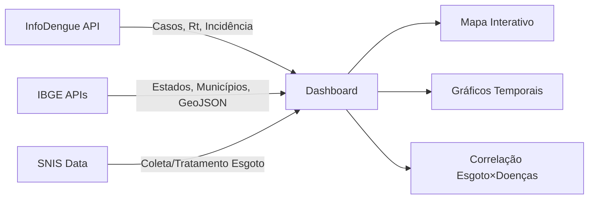

# VigiSaúde Brasil - Dashboard de Vigilância

---

## Sobre o Projeto

O **VigiSaúde Brasil** é um dashboard de vigilância epidemiológica que monitora **Dengue**, **Chikungunya** e **Zika** em tempo real, correlacionando os dados de doenças com indicadores de **saneamento básico** por estado.

O objetivo é visualizar a relação entre a cobertura de coleta e tratamento de esgoto e a incidência de doenças transmitidas por mosquitos no Brasil.

### Funcionalidades

- **Mapa Interativo** - Mapa do Brasil colorido por nível de alerta epidemiológico, com dados de saneamento nos popups
- **Rastreador de Doenças** - Gráficos de séries temporais para qualquer município brasileiro
- **3 Patógenos** - Dengue, Chikungunya e Zika (via InfoDengue)
- **Dados de Esgoto** - Cobertura de coleta e tratamento de esgoto por estado (SNIS)
- **Correlação Esgoto x Doenças** - Gráfico de dispersão mostrando a relação entre saneamento e incidência
- **Taxa Rt** - Monitoramento da taxa de reprodução com linha de referência Rt=1
- **Dados Climáticos** - Temperatura e umidade associados à transmissão
- **Busca de Municípios** - Pesquisa entre 5.570+ municípios do IBGE
- **Dark Mode** - Interface premium com glassmorphism

---

## APIs Públicas Utilizadas

| API | Descrição | Endpoint |
|-----|-----------|----------|
| **[InfoDengue](https://info.dengue.mat.br/)** | Alertas de Dengue, Chikungunya e Zika por semana epidemiológica | `info.dengue.mat.br/api/alertcity` |
| **[IBGE Localidades](https://servicodados.ibge.gov.br/api/docs/localidades)** | Estados e municípios do Brasil | `servicodados.ibge.gov.br/api/v1/localidades` |
| **[IBGE Malhas](https://servicodados.ibge.gov.br/api/docs/malhas)** | GeoJSON do mapa do Brasil por UF | `servicodados.ibge.gov.br/api/v3/malhas` |
| **[SNIS/SINISA](https://www.gov.br/cidades/pt-br/assuntos/saneamento/snis)** | Cobertura de esgoto por estado | Dados compilados (referência 2023) |

> Todas as APIs são **públicas e gratuitas**, sem necessidade de autenticação.

---

## Arquitetura

```
vigisaude-brasil/
├── index.html              # Estrutura HTML (3 views: Mapa, Rastreador, Info)
├── vite.config.js          # Configuração do Vite
├── package.json
├── .gitignore
└── src/
    ├── main.js             # Entry point — orquestra componentes
    ├── services/
    │   └── api.js          # Serviço de dados (InfoDengue, IBGE, SNIS)
    ├── components/
    │   ├── map.js          # Mapa Leaflet com GeoJSON e popups
    │   ├── charts.js       # Gráficos Chart.js (casos, Rt, incidência, clima, esgoto)
    │   ├── cards.js        # Cards de doenças na sidebar
    │   └── filters.js      # Filtros, seletores, busca
    └── styles/
        └── index.css       # Design system completo (dark mode, glassmorphism)
```

### Fluxo de Dados



---

## Como Executar

### Pré-requisitos

- [Node.js](https://nodejs.org/) v18+
- npm

### Instalação

```bash
# Clone o repositório
git clone https://github.com/madsondeluna/vsb-dashboard.git
cd esgoto-app

# Instale as dependências
npm install

# Inicie o servidor de desenvolvimento
npm run dev
```

O dashboard estará disponível em **http://localhost:3000**.

---

## Dados de Saneamento

Os dados de saneamento são do **SNIS (Sistema Nacional de Informações sobre Saneamento)**, referência 2022/2023. Incluem:

- **% Coleta de Esgoto** — Parcela da população com coleta de esgoto sanitário
- **% Tratamento de Esgoto** — Parcela do esgoto coletado que recebe tratamento

A correlação com dados epidemiológicos permite analisar como a infraestrutura de saneamento influencia a incidência de arboviroses no Brasil.

---

## Tecnologias

- **[Vite](https://vitejs.dev/)** — Build tool e dev server
- **[Leaflet](https://leafletjs.com/)** — Mapas interativos
- **[Chart.js](https://www.chartjs.org/)** — Gráficos e visualizações
- **Vanilla JS (ES Modules)** — Sem frameworks, código limpo e modular
- **CSS Custom Properties** — Design system com tokens de cores
- **Google Fonts** — Inter (UI) + JetBrains Mono (dados)

---

## Licença

Este projeto é open source e utiliza dados públicos abertos do governo brasileiro.

---

<div align="center">

Desenvolvido com dados abertos do Brasil

**[InfoDengue](https://info.dengue.mat.br/) · [IBGE](https://servicodados.ibge.gov.br/) · [SNIS](https://www.gov.br/cidades/pt-br/assuntos/saneamento/snis)**

</div>
